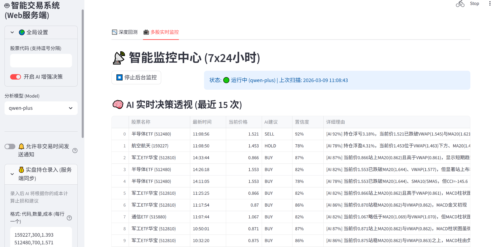
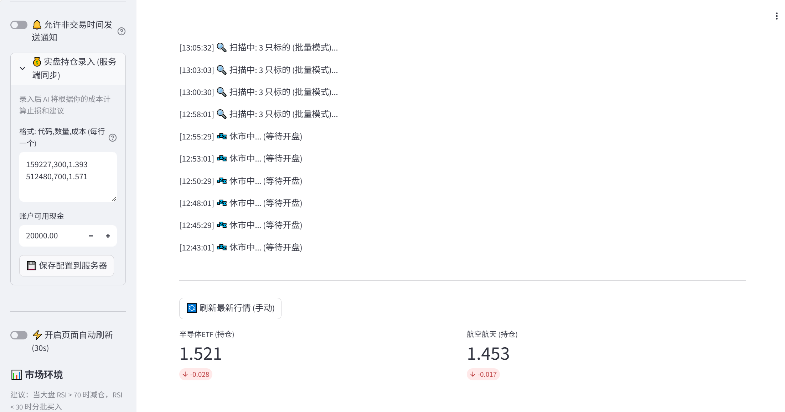

# AI Stock Trading Agent

[English](#english) | [中文](#chinese)

An automated stock trading monitoring system based on AI (LLM) and technical analysis.
这是一个基于 AI (LLM) 和技术指标分析的自动化股票交易监控系统。

---

<a id="english"></a>
## 🇬🇧 English Documentation

### Screenshots


*Real-time AI Decision Dashboard*


*Global Settings & Monitoring Control*

### Features

- **Multi-Model Support**: Compatible with OpenAI-format APIs (Qwen, DeepSeek, GPT-4, etc.).
- **Automatic Failover**: Automatically switches to backup models when the primary model fails (e.g., Qwen-Plus -> Qwen-Max -> Qwen-Turbo).
- **Technical Analysis**: Integrates key indicators including MA, MACD, RSI, CCI, VWAP, and ATR.
- **Real-time Monitoring**: Visualizes market data, portfolio status, and AI decisions in real-time via a Streamlit web interface.
- **Risk Management**: Built-in 1% risk rule, ATR dynamic stop-loss, trend following, and mean reversion strategies.
- **Notifications**: Supports WeCom (Enterprise WeChat) Webhook for trading signal alerts.

### Installation & Configuration

1.  **Clone the Repository**

    ```bash
    git clone https://github.com/yourusername/stock-agent.git
    cd stock-agent
    ```

2.  **Install Dependencies**

    ```bash
    pip install -r requirements.txt
    ```

3.  **Configure Environment Variables**

    Create a `.env` file in the project root (do not commit this file), and add your API keys:

    ```ini
    # Alibaba Cloud Qwen
    ALIYUN_KEY=sk-xxxxxxxxxxxxxxxx
    ALIYUN_URL=https://dashscope.aliyuncs.com/compatible-mode/v1
    
    # DeepSeek
    DEEPSEEK_KEY=sk-xxxxxxxxxxxxxxxx
    DEEPSEEK_URL=https://api.deepseek.com
    
    # OpenAI
    OPENAI_KEY=sk-xxxxxxxxxxxxxxxx
    OPENAI_URL=https://api.openai.com/v1

    # WeCom Webhook (Optional)
    WECOM_WEBHOOK=https://qyapi.weixin.qq.com/cgi-bin/webhook/send?key=xxxxxxxx
    ```

### Notification Setup (WeCom)

To receive real-time trading alerts on your phone:

1.  Create a group chat in **WeCom (Enterprise WeChat)**.
2.  Click the gear icon (Settings) -> **Group Robot** -> **Add Robot**.
3.  Select "Group Robot" and give it a name.
4.  After adding, copy the **Webhook URL**.
5.  Paste this URL into your `.env` file as `WECOM_WEBHOOK` or enter it in the Streamlit Sidebar settings.

### Usage

Start the Streamlit interface:

```bash
streamlit run gui.py
```

- **Sidebar**: Configure models, API keys, and notification settings.
- **Main Panel**: View real-time prices, AI decisions, and technical indicators.
- **AI Decision Perspective**: A rolling history of the last 15 AI decisions to track logic consistency.

### Disclaimer

- This project is for educational and research purposes only. It does not constitute financial advice.
- Stock trading involves risks. Please trade responsibly.
- Keep your API keys secure.

---

<a id="chinese"></a>
## 🇨🇳 中文文档

### 界面概览


*AI 实时决策透视看板*


*全局设置与监控面板*

### 功能特性

- **多模型支持**: 支持 OpenAI 格式接口 (Qwen, DeepSeek, GPT-4 等)。
- **自动故障切换**: 当首选模型调用失败时，自动切换到备用模型池 (如 Qwen-Plus -> Qwen-Max -> Qwen-Turbo)。
- **技术分析**: 集成 MA, MACD, RSI, CCI, VWAP, ATR 等多种技术指标。
- **实时监控**: 通过 Streamlit 界面实时展示行情、持仓状态和 AI 决策。
- **风控管理**: 内置 1% 风险模型、ATR 动态止损、趋势跟踪与均值回归策略。
- **消息通知**: 支持企业微信 Webhook 通知交易信号。

### 安装与配置

1.  **克隆仓库**

    ```bash
    git clone https://github.com/yourusername/stock-agent.git
    cd stock-agent
    ```

2.  **安装依赖**

    ```bash
    pip install -r requirements.txt
    ```

3.  **配置环境变量**

    在项目根目录下创建一个 `.env` 文件 (请勿上传到 GitHub)，填入您的 API Key：

    ```ini
    # 阿里云千问 Qwen
    ALIYUN_KEY=sk-xxxxxxxxxxxxxxxx
    ALIYUN_URL=https://dashscope.aliyuncs.com/compatible-mode/v1
    
    # DeepSeek
    DEEPSEEK_KEY=sk-xxxxxxxxxxxxxxxx
    DEEPSEEK_URL=https://api.deepseek.com
    
    # OpenAI
    OPENAI_KEY=sk-xxxxxxxxxxxxxxxx
    OPENAI_URL=https://api.openai.com/v1

    # 企业微信 Webhook (可选)
    WECOM_WEBHOOK=https://qyapi.weixin.qq.com/cgi-bin/webhook/send?key=xxxxxxxx
    ```
    
    或者在您的服务器/部署环境中直接设置这些环境变量。

### 消息推送配置 (企业微信)

为了在手机上实时接收交易预警，建议配置企业微信机器人：

1.  在 **企业微信** 中发起一个群聊 (或者使用现有群聊)。
2.  点击群设置 (右上角三个点) -> **群机器人** -> **添加机器人**。
3.  点击右上角“新创建一个机器人”，取个名字并添加。
4.  添加成功后，复制 **Webhook 地址**。
5.  将该地址填入 `.env` 文件的 `WECOM_WEBHOOK` 字段，或者在网页端侧边栏的“通知设置”中填入。

### 使用说明

启动 Streamlit 界面：

```bash
streamlit run gui.py
```

- **侧边栏 (Sidebar)**: 
    - **API 设置**: 动态切换模型 (Qwen, DeepSeek 等) 并配置 Key。
    - **持仓录入**: 输入您的持仓代码、数量和成本，AI 将基于此进行止盈止损分析。若输入 `代码,0,0` 则视为加入自选股监控。
    - **通知设置**: 开启/关闭非交易时间通知，配置 Webhook。
- **主面板**: 
    - **深度回测**: 使用历史数据验证策略。
    - **多股实时监控**: 7x24小时轮询监控，展示 AI 实时买卖建议。
- **AI 决策透视**: 表格化展示最近 15 次 AI 的决策逻辑、置信度及详细理由。

### 注意事项

- 本项目仅供学习和研究使用，不构成投资建议。
- 股市有风险，入市需谨慎。
- 请妥善保管您的 API Key，不要泄露给他人。
